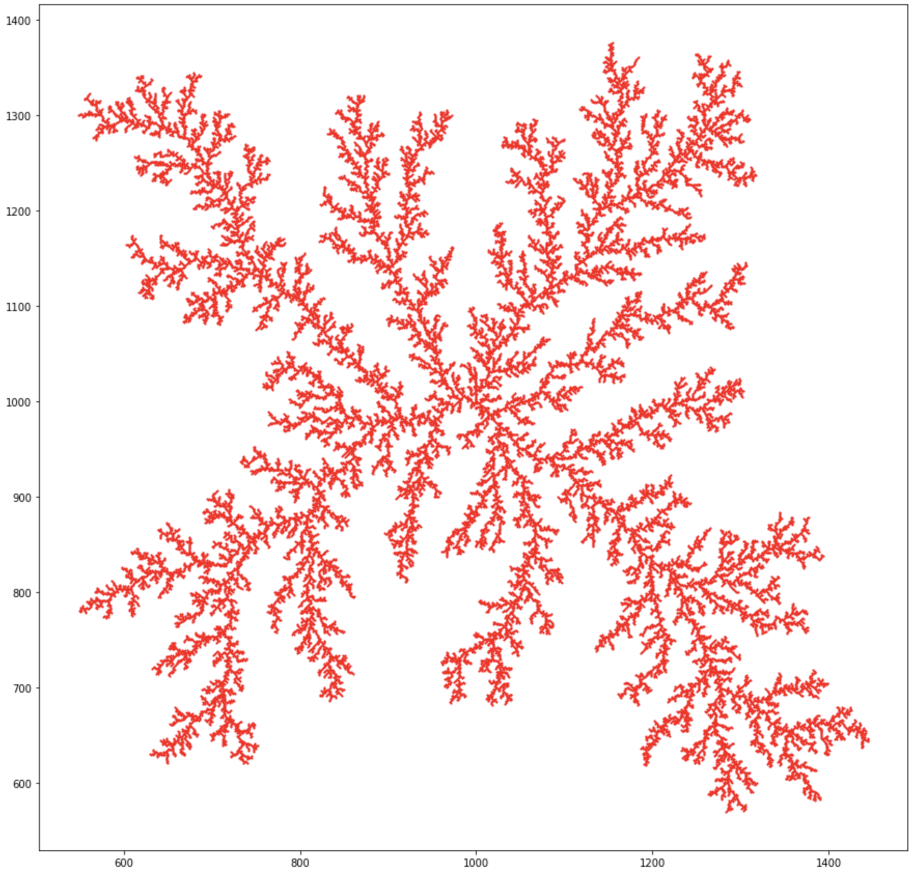

# diffusion_limited_aggregation

Computes a grid-based DLA using particle swarm diffusion. The method uses vectorized operations (numpy) operations for scalability.

Particles are generated randomly along a circular radius that grows as the cluster grows. They diffuse by taking a single random step (vertically or horizontally) in the grid. 

Diffusion for any individual particle stops when it is adjacent to a cluster particle or strays too far from the cluster. In both cases, the particle is replaced with a new random particle along the current radius. 

Adjacency can be determined by either 4-way or 8-way nearest neighbors, depending on the "diagonals" flag (True includes diagonals, making 8 neighbors).

The following example was generated from the default parameters in the notebook.

